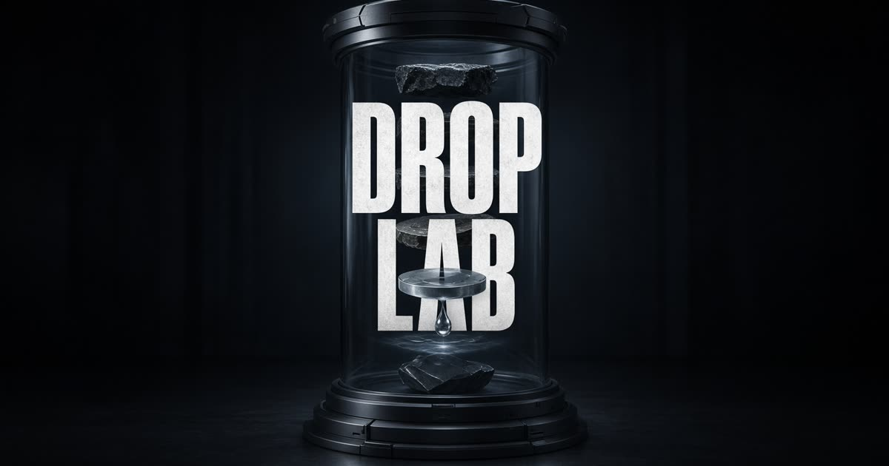

# Drop Lab · 掉落實驗室

[繁體中文](README.md) | **English**

**[Live Demo / 線上展示](https://bay-gem-iris-pilot.grok.me/)**

A 3D physics playground: drop spheres, boxes, and cylinders, then watch them stack, bounce, and topple under gravity. Drag and throw objects while adjusting gravity and restitution in real time.



## Features

- Drop **spheres, boxes, or cylinders**; click once for one object or hold to keep spawning
- Drag rigid bodies and release them with throwing velocity
- Drag empty space to orbit the camera; scroll to zoom
- Adjust **gravity** (0–20) and **restitution** (0–1) in real time
- Clear the scene or pause / resume the simulation
- An unstable starting tower demonstrates collisions immediately
- Approximately 56 objects maximum; the oldest are removed when the limit is exceeded
- Desktop and mobile controls

## Controls

| Input | Action |
| --- | --- |
| Sphere / box / cylinder button | Drop the selected shape from above |
| Hold a shape button | Spawn continuously |
| Drag an object | Grab and move it; release to throw |
| Drag empty space | Orbit the camera |
| Scroll wheel / pinch | Zoom |
| Clear | Remove all dynamic objects |
| Pause | Freeze the simulation |
| `1` `2` `3` | Drop a sphere / box / cylinder |
| `Space` | Drop another object of the current shape |
| `C` or `Delete` | Clear |
| `P` | Pause / resume |

## Tech stack

- [React 19](https://react.dev/) + [TanStack Start](https://tanstack.com/start)
- [Three.js](https://threejs.org/) via [React Three Fiber](https://r3f.docs.pmnd.rs/) + [drei](https://github.com/pmndrs/drei)
- [Rapier](https://rapier.rs/) rigid-body physics with a fixed 1/60 simulation step
- [Tailwind CSS v4](https://tailwindcss.com/) + [Zustand](https://github.com/pmndrs/zustand)
- Vite 8; deployment target: Vercel

## Run locally

Requires **Node.js 22**.

```bash
npm install
npm run dev
```

The development server defaults to `http://localhost:8080`.

```bash
npm run build      # Production build
npm run typecheck  # TypeScript checks
npm run preview    # Preview the build
```

## Project structure

```text
src/
  components/playground/   # Scene, rigid bodies, dragging, and toolbar
  routes/                  # TanStack Router pages
  styles.css               # Design tokens
public/                    # Favicon and Open Graph image
```

## License

MIT
